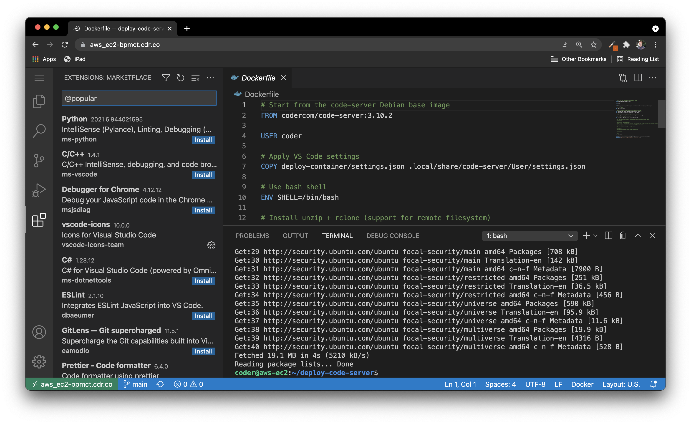

# deploying `code-server` on AWS EC2

> ⚠️ The deploy script referenced in this guide uses the code-server --link service which is now deprecated. If this solution does not work for you, we recommend following our guide to use [LetsEncrypt with Caddy](https://coder.com/docs/code-server/latest/guide#using-lets-encrypt-with-caddy) to securely connect to code-server on your VM.



[AWS EC2](https://aws.amazon.com/ec2/) is a popular way to manage and launch virtual machines. Here is a fast way to launch a code-server machine with AWS EC2:

1. Log into AWS and head over to the [EC2 dashboard](https://us-west-2.console.aws.amazon.com/ec2/v2/home?region=us-west-2). Launch a new instance.

2. Use the "Ubuntu Server 20.04 LTS" 64-bit (x86) Quick Start.

3. Choose `t2.micro` instance type or larger.

4. Click `Next: Configure Instance Details` to add the code-server script.

5. Under `User data`, copy & paste the [launch-code-server.sh](../deploy-vm/link/launch-code-server.sh) script.

6. Expand your storage, if necessary under the "Add Storage" section.

7. Under "Security Groups," ensure you have rows for "SSH" (:22) and "HTTP" (:80)

8. Add any SSH keys, if necessary, and launch the instance.

9. Once your instance starts, you can simply navigate to the public IP address and get forwarded to a secure version of code-server, which will be proxied behind your GitHub account (the first one you log in with). For information on how this works, see [code-server --link](https://github.com/cdr/code-server#cloud-program-%EF%B8%8F).

10. Optional: To change the URL in the address bar from `ip-[xxxx]` to something more descriptive, you just need to change your hostname and restart code-server:

```sh
sudo hostnamectl set-hostname bens-devbox
sudo systemctl restart code-server@coder
```

See our [troubleshooting guide](../deploy-vm#troubleshooting) if you are unable to connect after some time.
